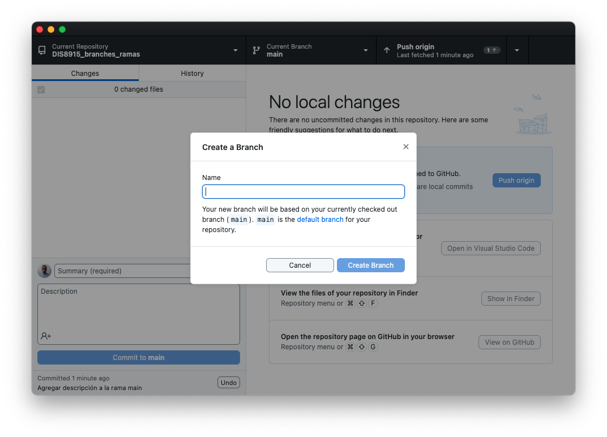

# DIS8915_branches_ramas
Guía para implementar la característica de git llamada branch

## Descripción 
En GitHub, las ramas son una característica fundamental que permite trabajar en diferentes versiones de un proyecto simultáneamente. Cada repositorio de GitHub tiene una rama principal, comúnmente llamada main o master, que representa la versión estable del proyecto. Aquí tienes una descripción general del uso de ramas en GitHub 

### Características 
1. Crear una nueva rama: Puedes crear una nueva rama para trabajar en una nueva función, solucionar un error o realizar cualquier otro cambio en tu proyecto. Esto se puede hacer directamente desde la interfaz web de GitHub o utilizando la línea de comandos.

Para crea una nuera rama en GitHub Dektop elige en la barra de menú la opción **Branch** y luego **New Branch**

2. Cambiar entre ramas: Puedes cambiar entre diferentes ramas para ver y trabajar en diferentes versiones de tu proyecto. Esto te permite mantener la versión principal del proyecto intacta mientras trabajas en nuevas características o correcciones de errores en otras ramas.
3. Agregar cambios a una rama: Una vez que hayas realizado cambios en tu proyecto en una rama específica, puedes agregar esos cambios a esa rama utilizando **commit**, como lo harías normalmente. Estos cambios permanecerán en esa rama hasta que decidas fusionarlos con otra rama o enviarlos como una solicitud de extracción (pull request).
4. Fusionar ramas: Cuando estés listo para incorporar los cambios de una rama a otra (por ejemplo, fusionar una función nueva en la rama principal), puedes hacerlo utilizando una solicitud de extracción en GitHub o mediante comandos en la línea de comandos. Esto combinará los cambios de una rama en otra.
5. Resolver conflictos: A veces, pueden surgir conflictos al fusionar ramas si los cambios en una rama entran en conflicto con los cambios en otra. En tales casos, tendrás que resolver manualmente estos conflictos para determinar qué cambios deben mantenerse.
6. Eliminar ramas: Una vez que hayas terminado de trabajar en una rama y ya no la necesites, puedes eliminarla. Esto te ayudará a mantener tu repositorio ordenado y evitar la acumulación de ramas innecesarias.  

En resumen, las ramas en GitHub te permiten trabajar de manera colaborativa y organizada en proyectos, facilitando la implementación de nuevas características, la corrección de errores y la experimentación sin afectar la versión principal del proyecto.