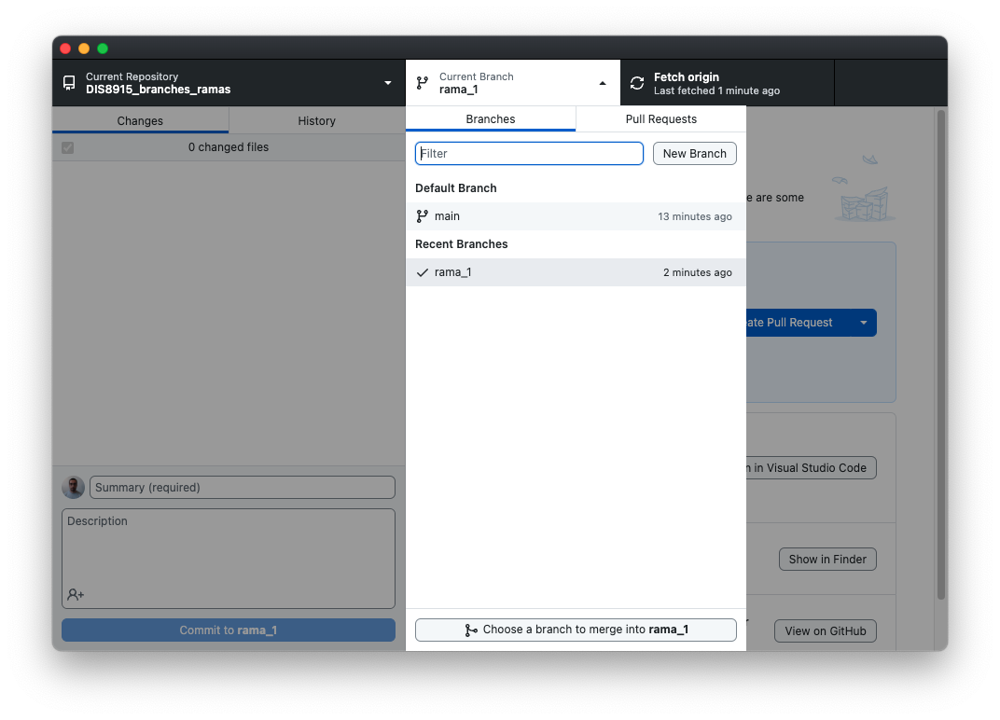

# DIS8915_branches_ramas
Guía para implementar la característica de git llamada branch

## Descripción 
En GitHub, las ramas son una característica fundamental que permite trabajar en diferentes versiones de un proyecto simultáneamente. Cada repositorio de GitHub tiene una rama principal, comúnmente llamada main o master, que representa la versión estable del proyecto. Aquí tienes una descripción general del uso de ramas en GitHub:

### Características
2. Cambiar entre ramas: Puedes cambiar entre diferentes ramas para ver y trabajar en diferentes versiones de tu proyecto. Esto te permite mantener la versión principal del proyecto intacta mientras trabajas en nuevas características o correcciones de errores en otras ramas.

